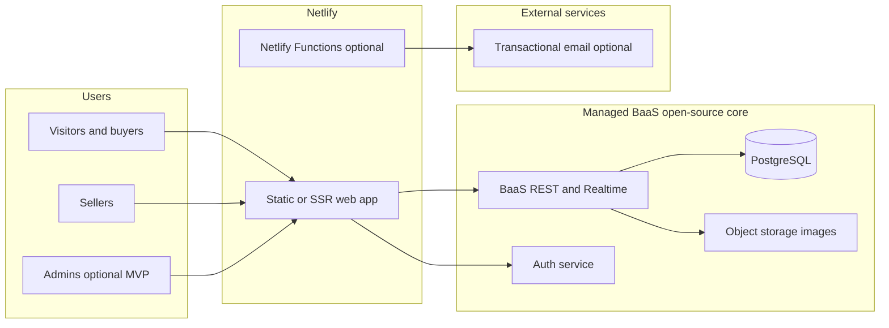
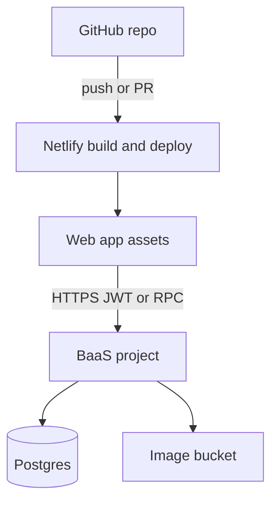
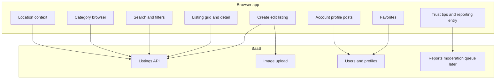

# Architecture & implementation plan

**Product:** Modern local marketplace (Craigslist-style redesign)  
**Constraints:** Front end on **Netlify**, **open-source** software for app code, managed **DB/BaaS** acceptable  
**Sources reviewed:** `docs/requirements/` (business plan, feature comparison, Figma export `Craigslit_design_MainA.png`, user stories spreadsheet)

This document is for review **before** implementation. Adjust scope or stack after you read the open decisions in §7.

---

## 1. Goals aligned to your documents

| Source | Implication for architecture |
|--------|-------------------------------|
| Business plan MVP | Mobile-first UI, search/filter/categories, posting + listing management, **verification + reputation** |
| Business plan later phases | Messaging & notifications (Phase 2), AI moderation (Phase 3), premium placement (Phase 4) |
| Feature comparison | Keep flows simple and local; add **smart category suggestions** and **reputation** in MVP where feasible |
| Figma (main screen) | Regions, category cards with counts, global search, favorites, profile, **listing cards** (photo, category, price/range, location, relative time) |
| User stories (US-01–14) | Locations, accounts, category drill-down, **advanced search** (OR with `\|`, exclude with `-`), contact seller, rich listings (photos, price, renew/edit), trust/safety content |

---

## 2. High-level system context

Clients talk to **Netlify-hosted** UI and **BaaS APIs**; no dedicated VPS required for MVP.



**Recommendation:** Implement **most data and auth through one BaaS** (see §4) so you avoid running your own API server early. Use **Netlify Functions** only for small gaps (e.g. webhooks, email proxy) if the BaaS cannot do something cleanly.

---

## 3. Deployment view (Netlify + BaaS)



- **CI/CD:** Connect the GitHub repo to Netlify; production deploys from `main` (or your chosen branch).  
- **Secrets:** BaaS URL and **anon** keys live in Netlify **environment variables**; never commit secrets.  
- **Preview:** Enable Netlify deploy previews for branches to test changes safely.

---

## 4. Recommended open-source-friendly stack (MVP)

| Layer | Choice | Why |
|-------|--------|-----|
| UI framework | **React** + **Vite** | Large tutorial ecosystem; builds to static files Netlify serves easily |
| Language | **TypeScript** (recommended) | Safer refactors as the app grows; optional if you prefer plain JS |
| Styling | **CSS Modules** or **Tailwind CSS** | Matches card-based Figma layout; Tailwind has many copy-paste examples |
| Routing | **React Router** | Standard for multi-page flows (home, category, listing, post, account) |
| BaaS | **Supabase** | Open-source **Postgres**, auth, row-level security, **Storage** for listing photos, **Realtime** ready for Phase 2 messaging |
| Search (MVP) | **Postgres** full-text + indexes | Matches pipe/OR and minus logic with query building in app or SQL; avoids extra search infra at first |
| i18n / content | Optional later | MVP can be English-only |

**Alternatives (still valid):** **Next.js** on Netlify if you want file-based routing and SSR later; **Appwrite** or self-hosted **Parse** if you want to avoid a specific vendor (more ops burden). For a small team and Netlify-first deployment, **Supabase + SPA** is the most common “starter” path.

---

## 5. Logical components (MVP)



**Figma mapping:**

- Header: location picker, search, favorites, profile  
- Category row: query `listings` aggregated **by category** for counts  
- Recent grid: query with sort `created_at desc` and region filter  

---

## 6. Conceptual data model (MVP+)

Use roughly these entities in Postgres (exact columns to be finalized in schema design).

```mermaid
erDiagram
  REGION ||--o{ LISTING : contains
  USER ||--o{ LISTING : owns
  CATEGORY ||--o{ LISTING : classifies
  CATEGORY ||--o{ CATEGORY : parent
  USER ||--o{ FAVORITE : saves
  LISTING ||--o{ FAVORITE : starred_in
  USER ||--o{ USER_REPUTATION : has
  LISTING ||--o{ LISTING_IMAGE : has

  REGION {
    uuid id PK
    string slug
    string display_name
  }

  CATEGORY {
    uuid id PK
    uuid parent_id FK
    string slug
    string name
  }

  USER {
    uuid id PK
    string email
    boolean verified_flag
    string display_name
  }

  LISTING {
    uuid id PK
    uuid seller_id FK
    uuid region_id FK
    uuid category_id FK
    string title
    text body
    numeric price_min
    numeric price_max
    string price_label
    string obo_flag
    tsvector search_document
    timestamptz created_at
    timestamptz expires_at
    string status
  }

  LISTING_IMAGE {
    uuid id PK
    uuid listing_id FK
    string storage_path
    int sort_order
  }

  FAVORITE {
    uuid user_id FK
    uuid listing_id FK
  }

  USER_REPUTATION {
    uuid user_id PK FK
    numeric score
    int completed_transactions_reported
  }
```

**Search:** Maintain a `search_document` (or generated column) from title + description; interpret user query for OR (`|`) and NOT (`-word`) in application code → SQL `tsquery` or `ILIKE` patterns for MVP. Add trigram (`pg_trgm`) for fuzzy matching if needed.

**Verification / reputation (MVP per business plan):** Start with **email verification**, optional **phone OTP** later, and a **simple reputation score** (e.g. badges or numeric) updated manually or by lightweight rules—avoid over-engineering before you have traffic.

---

## 7. Phased delivery plan (mapped to your phases)

### Phase A — MVP (ship a credible marketplace)

**Goal:** Match Figma home experience + core marketplace loops for one or two pilot regions.

| Theme | Scope |
|-------|--------|
| Regions | US-01: select region; persist choice (local storage + user profile when logged in) |
| Auth & accounts | US-02: sign up / sign in; dashboard for “my listings” |
| Categories | US-03: hierarchical categories; URLs per category |
| Listings | US-07–10, US-13: create, edit, renew, expire; price and OBO; multiple photos (US-09) |
| Browse & search | US-04: keyword search with OR / minus; filter by region + category; sort (recent, relevance later) |
| Discovery UI | Category cards with **counts**; **recent** grid like mockup |
| Favorites | Persist favorites (logged-in); optional anonymous local-only if you want a faster first version |
| Trust | US-11–12: static safety content + **report listing** (stores flag for admin review) |

**MVP contact (US-05) — decided:** **Option A** — in-app **contact form** on each listing that submits to a **server-side** sender (e.g. Netlify Function). The buyer never sees the seller’s real email; the seller receives one message (and optionally a reply-to you control). This is **not** full Craigslist-style bidirectional anonymized relay; that remains a Phase B+ enhancement if needed.

**Defer for MVP (revisit in Phase B+):**

- **Full anonymized email relay** (inbound parse, thread IDs, deliverability).  
- **AI moderation (Phase 3)** — out of scope for MVP; use reports + manual review.

### Phase A backlog (ordered for implementation)

Work top to bottom; each item should be **demoable** before moving on. Story IDs reference `docs/requirements/craigslist_user_stories_Claude.xlsx`.

| # | Backlog item | User stories | Outcome |
|---|----------------|--------------|---------|
| A0 | **Project foundation** | — | GitHub → Netlify deploy; env vars; Supabase project created; empty app loads in prod. |
| A1 | **Regions** | US-01 | User picks region (e.g. Minneapolis); choice persisted (localStorage + profile when logged in); listings scoped by region. |
| A2 | **Auth & session** | US-02 | Sign up, sign in, sign out; protected routes; “my account” shell. |
| A3 | **Category model & URLs** | US-03 | Seed categories (Housing, Jobs, For Sale, Services, Community, Gigs + subcategories as needed); browse by category routes. |
| A4 | **Listings CRUD (no images)** | US-07, US-08, US-13 | Create / edit / renew / expire listing (title, body, price, OBO, location text); seller dashboard lists own posts. |
| A5 | **Images** | US-09 | Upload photos to object storage; multiple images per listing; order and delete. |
| A6 | **Home & discovery UI** | Figma | Category cards with live **counts**; **recent listings** grid; header with location + search affordance. |
| A7 | **Search & filters** | US-04 | Keyword search with **OR** (`\|`) and **exclude** (`-term`); filter by region + category; sort (at least “most recent”). |
| A8 | **Listing detail** | US-05 prep | Full listing page with photos, metadata, and **contact seller** entry point (wire to A9). |
| A9 | **Contact seller (Option A)** | US-05 | Form collects message (+ buyer contact if you allow anonymous contact); **server-side** email to seller via transactional provider (see §7a); rate limiting / basic abuse limits. |
| A10 | **Favorites** | Figma | Logged-in user can save/unsave listings; favorites list view. |
| A11 | **Trust & reporting** | US-11, US-12, US-13 partial | Safety/help pages; **report listing** creates admin-reviewable record; static scam-awareness copy. |
| A12 | **Polish & pilot** | US-14 (content) | Copy for seasonal tips optional; performance pass; pick 1–2 pilot regions; smoke E2E on critical paths. |

**Out of Phase A:** messaging threads, push notifications, AI moderation, payments, premium listings, full email relay.

### 7a. Transactional email (Option A) — what you need

You do **not** need to run your own mail server for MVP. Use a **transactional email provider** that offers **SMTP** and/or an **HTTP API**. The browser must **never** hold SMTP credentials; a **Netlify Function** (or Supabase Edge Function) sends mail using secrets from environment variables.

| Need | Why |
|------|-----|
| **Provider account** | Examples: [Resend](https://resend.com), [SendGrid](https://sendgrid.com), [Mailgun](https://www.mailgun.com), [Postmark](https://postmarkapp.com), [Amazon SES](https://aws.amazon.com/ses/). Pick one; compare free tiers and docs. |
| **“From” domain** | Use a domain you control (e.g. `notifications.yourdomain.com`). Sending from `@gmail.com` via SMTP is fragile and often blocked. |
| **DNS records** | Add the provider’s **SPF**, **DKIM**, and (recommended) **DMARC** records at your DNS host. Without these, mail often lands in spam. |
| **API key or SMTP password** | Store in **Netlify** (or function host) env vars: e.g. `EMAIL_PROVIDER_API_KEY`, `SMTP_URL` if using SMTP from the function. |
| **Sending function** | One function: accepts POST from your contact form (after auth/session checks), validates input, sends email to **seller’s address stored server-side only**, logs send or failure. |
| **Abuse controls** | Rate limit by IP/user, honeypot or CAPTCHA if spam appears, max body length. |
| **Supabase Auth note** | Password reset and verification emails use Supabase’s mailer by default; you can keep that separate from “contact seller” mail, or configure Supabase SMTP with the same provider later for consistency. |

**SMTP vs API:** Most providers offer both. **HTTP API** from the function is often simpler than raw SMTP from Node. If you use **SMTP**, Node libraries (`nodemailer`) connect with `smtps://` using credentials from env—still only inside the serverless function.

### Phase B — Engagement

- Enhanced **messaging** and **notifications** (business plan Phase 2; Supabase Realtime can back this).  
- Richer **email** or push (web push) notifications.  
- Deeper **reputation** and verification flows.

### Phase C — Trust at scale

- **AI-assisted** spam/scam scoring (business plan Phase 3); batch or async jobs; may use Netlify Functions + queue or BaaS **Edge Functions**.  
- Improved moderation tools.

### Phase D — Monetization

- **Premium listings** and promoted placement (business plan Phase 4); Stripe or similar for payments; keep pricing logic server-side (Functions or BaaS policies).

---

## 8. Repository and Git workflow (beginner-friendly)

- **Branches:** `main` = production; short-lived `feature/…` branches for changes.  
- **Docs:** Keep `docs/requirements` and `docs/architecture` updated when scope changes.  
- **Commits:** Small, message in plain English (“Add category listing count query”).

---

## 9. Testing strategy (ties to your Gherkin)

| Level | Tooling (open source) | Notes |
|-------|------------------------|-------|
| Unit | Vitest | Search query parser, price helpers |
| Contract / API | Supabase client + test project | Optional second Supabase project for CI |
| E2E | Playwright | Automate a few **critical** scenarios from the spreadsheet (location, post listing, search) |

You do **not** need full Gherkin automation on day one; pick **5–10 scenarios** that define MVP success.

---

## 10. Risks and mitigations

| Risk | Mitigation |
|------|------------|
| Scope creep (AI, email relay, payments) | Lock **Phase A** backlog; treat everything else as documented future phase |
| Search complexity | MVP: Postgres full-text + explicit rules for `\|` and `-`; add dedicated search engine only if needed |
| Image abuse / cost | Storage limits per user; server-side max size; moderation queue |
| Beginner velocity | Stay on **one** BaaS + **one** UI stack; avoid microservices until necessary |

---

## 11. Suggested next steps before coding

1. ~~Confirm **MVP contact model**~~ — **Option A** (contact form + transactional email) is selected.  
2. Freeze **category tree** for pilot (can match Figma: Housing, Jobs, For Sale, Services, Community, Gigs).  
3. Register **sending domain** and add DNS for your chosen email provider (§7a).  
4. Create **Supabase** project; sketch SQL migrations for tables above.  
5. Scaffold **Vite + React** repo, connect Supabase client, deploy empty app to **Netlify**.  
6. Follow **Phase A backlog** (§7) from A0 downward.

---

## Appendix: User story IDs referenced

US-01 region; US-02 account; US-03 categories; US-04 search; US-05 contact; US-06 offline transaction (product guidance); US-07–11 listing and safety; US-12 scams; US-13 edit/renew; US-14 seasonal (editorial / UX tip).

---

*MVP contact: Option A. Phase A backlog: §7. Email setup: §7a.*

*Treat this file as the baseline architecture charter for implementation.*
